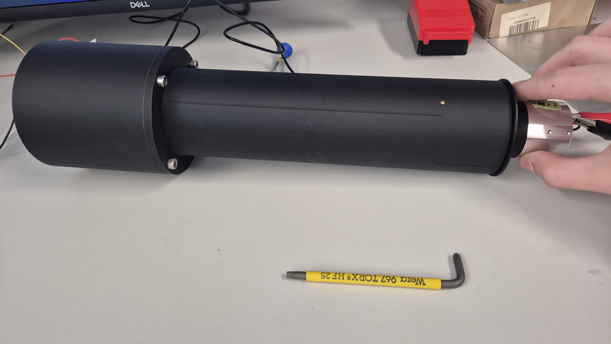
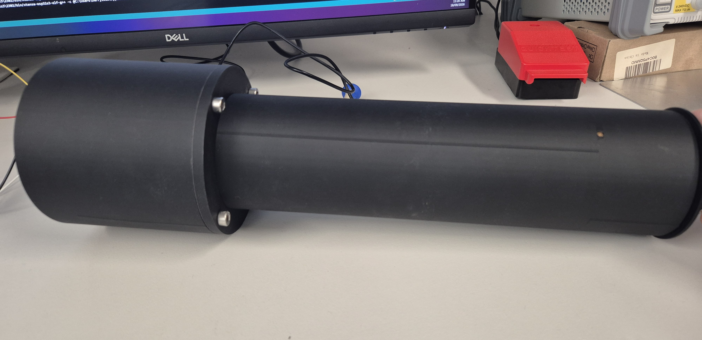
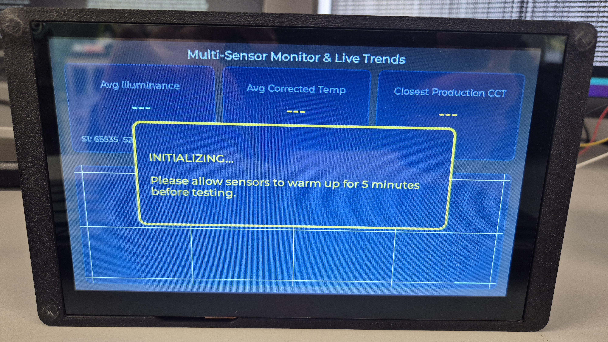
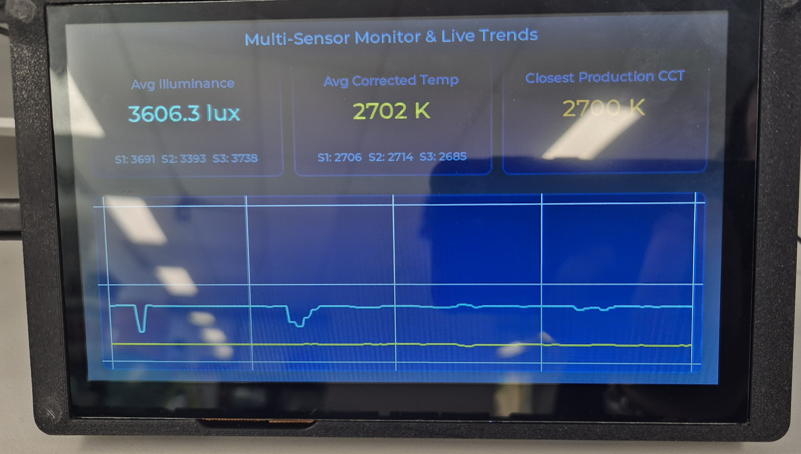

# High-Precision LED Quality Control Monitor

An industrial metrology tool designed for high-accuracy LED color temperature (CCT) and Illuminance (Lux) verification on the factory assembly line.
Built on an ESP32-S3 CrowPanel HMI Display, this instrument aggregates data from a custom wand containing three I2C multiplexed DFRobot color temperature sensors. To overcome the inherent non-linear response curves of silicon optical sensors, the firmware utilizes individual, multi-point Piecewise Linear Interpolation Lookup Tables (LUTs), strictly calibrated against an Everfine Integrating Sphere and Sekonic C-7000 spectrometer.

**Hardware Stack**
-

MCU/Display: Elecrow CrowPanel ESP32-S3 Display (800x480 resolution)

Sensors: 3x DFRobot Color Temperature & Lux Sensors (I2C)

Multiplexer: 8-Channel I2C Multiplexer (Address 0x70)

Housing: Custom 3D-printed wand with a locked 20cm focal standoff and ambient light shrouding.

**Software Dependencies**
-

To compile this project in the Arduino IDE or PlatformIO, you will need the following libraries:

esp_display_panel.hpp (Elecrow's display driver)

lvgl.h (Light and Versatile Graphics Library - v8.x)

DFRobot_ColorTemperature.h (Sensor driver)

Standard Wire.h for I2C communication

## IDE & Compiler Configuration

If building via the Arduino IDE, the ESP32-S3 requires specific board settings to allocate enough memory for the LVGL frame buffers. Ensure the following are set in the `Tools` menu prior to compilation:

*   **Board:** ESP32S3 Dev Module
*   **Flash Size:** 8MB (or match your specific CrowPanel variant)
*   **Partition Scheme:** 8M with spiffs (3MB APP/1.5MB SPIFFS)
*   **PSRAM:** OPI PSRAM 
*   **USB CDC On Boot:** Enabled (For Serial debugging)

**Wiring & Setup**
-

Connect the I2C Multiplexer to the ESP32-S3 SDA (Pin 19) and SCL (Pin 20).

Connect the three DFRobot sensors to channels 0, 1, and 2 of the multiplexer.

Supply clean 3.3V/5V power to the sensor array.

Here is the PCB design for the extender module:

Here is the wiring diagram:

**Calibration Update Guide**
-

If swapping sensors or re-calibrating against a new integrating sphere, update the cal_table_s1, cal_table_s2, and cal_table_s3 arrays in the main loop.

Format: {Raw_Wand_Reading, True_Sphere_Reading}

Requirement: Data must be listed in strictly ascending order for the piecewise logic to route properly.

## Operation Guide

1.  **Boot & Initialization:** Upon power-up, the system will initialize the I2C bus and LVGL graphics. Wait for the "Warm-Up Sequence" message to clear.
2.  **Sensor Placement:** Insert the custom 3D-printed wand directly over the LED array, ensuring the shroud rests flush against the surface to block ambient light.
3.  **Data Readout:** The UI will dynamically poll the multiplexer and display real-time CCT and Lux metrics. Data updates at approximately 10Hz.

## In-Field Use Case & Hardware

### 1. The QC Monitor Station (In Use)
*The fully assembled CCT Tester stationed on the test bench.*

### 2. Custom 3D Printed Housing
*The custom 3D-printed housing and aperture designed for the CCT Tester.*

### 3. Warm-Up Sequence
*The system initialization and warm-up message.*

### 4. Live UI Dashboard
*The LVGL interface updating dynamically during live testing.*

